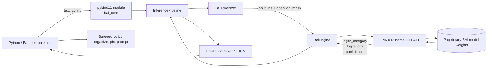
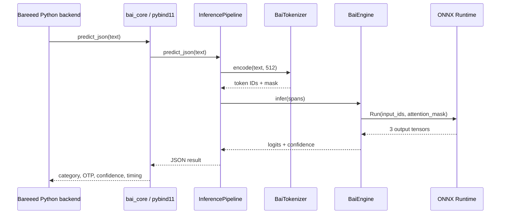

# Khwarazma BAI

## Bareeed Artificial Intelligence

[](core/CMakeLists.txt)
[](requirements.txt)
[](core/src/engine.cpp)
[](LICENSE)
[](.tmp_docs/technical_reference.txt)

**Khwarazma BAI** (Bareeed Artificial Intelligence) is the compact inference engine behind the Bareeed email organizer. It is designed for fast, privacy-preserving mail triage: filtering spam, recognizing one-time passwords (OTPs), auto-pinning important messages, routing lower-value mail, and prompting the user when confidence is not high enough for autonomous action.

BAI is intentionally task-bound rather than a general-purpose assistant. The public engineering surface contains the C++23 runtime core, ONNX Runtime bridge, tokenizer, JSON interface, C API, Python bindings, and training/export utilities. Proprietary production model weights remain closed and are not granted for redistribution or competing deployment.

> **Evidence note:** The repository's direct benchmark measured a **0.6939 ms mean** over 1,000 sequential `predict_json` calls and **14.54 MB RSS** in the recorded Linux environment. These are environment-specific measurements, not universal hardware guarantees.

## Khwarazma philosophy

Khwarazma builds focused intelligence for real products: small enough to run close to the user, fast enough to stay out of the way, and explicit enough to audit. Bareeed should organize mail without turning private correspondence into a remote analytics dependency. BAI therefore keeps the production decision path compact, native, and observable:

- **Privacy by design:** classification is intended to run inside Bareeed's backend boundary.
- **Useful autonomy:** confident decisions can be automated; uncertain decisions should return to the user through a prompt.
- **Engineering over hype:** performance and capability claims are separated from measured evidence.
- **Arabic-first ambition:** the data pipeline currently represents Arabic and English dialect families while leaving room for future conversational, multi-dialect models.

## What BAI does for Bareeed

The engine provides the model-facing primitives used by the Bareeed integration:

| Capability | Runtime behavior |
| --- | --- |
| Mail triage | Produces one of five categories: `inbox_pinned`, `inbox`, `bait`, `bais`, or `baiads`. |
| OTP handling | Returns an OTP logit, boolean detection result, and sigmoid confidence. |
| Priority | Supports the `inbox_pinned` decision for messages that should remain prominent. |
| Confidence-aware UX | Returns an overall confidence score for the backend to apply its prompting policy. |
| Privacy | The native engine accepts text and returns a compact result; application policy remains with Bareeed. |

The current runtime returns category, OTP, confidence, and execution metadata. Expiration, purge, user prompting, authorization, persistence, and mail-provider actions belong to the Bareeed application layer; they are not silently performed by this repository.

## Behind the scenes

Conceptual Bareeed request lifecycle:

```text
Incoming email
     |
     v
Bareeed backend -> BAI Python binding -> C++ InferencePipeline
                                      |
                                      +-> normalize + tokenize
                                      +-> fixed-length int64 tensors
                                      +-> ONNX Runtime session
                                      +-> category / OTP / confidence
     |
     +--> high confidence: apply Bareeed policy
     +--> low confidence: prompt the user
     |
     v
Organized inbox, OTP workflow, or user decision
```

For product demonstrations, this flow can be presented as an animation: an email card enters the Bareeed inbox, its text becomes token blocks, the blocks cross the C++/ONNX boundary, three signal badges appear (folder, OTP, confidence), and the card either moves automatically or pauses with a “Confirm?” prompt. This is a conceptual integration storyboard, not an animation asset shipped by this repository.

## Architecture and data flow





## Repository map

```text
core/
  include/                 C++ interfaces, C API, tokenizer, JSON contracts
  src/                     ONNX Runtime engine and inference implementation
  bindings/bai_pybind.cpp  Python extension
  CMakeLists.txt           C++23 / pybind11 build
training/
  model.py                 BaiMicroEncoder definition
  train.py                 PyTorch training and confidence objective
  export.py                ONNX export, quantization, validation
  generate_data.py         Dialect-aware synthetic data generation
  validate_data.py         Data validation, deduplication, and splits
config/                    Language and policy metadata
data/                      Dialect mappings, manifests, and processed data
tests/                     Dialect schema checks and performance regression test
```

## Performance

The checked-in performance test (`tests/test_performance.py`) warms the pipeline with 10 calls, then performs 1,000 sequential calls. It times `predict_json` plus Python `json.loads`, and checks process RSS growth.

| Measure | Target | Recorded evidence |
| --- | ---: | ---: |
| Mean request latency | `< 15 ms` | **0.6939 ms** |
| Process RSS | `< 150 MB` | **14.54 MB** |
| RSS growth during loop | `<= 5 MB` | Passed in the recorded run |

The benchmark excludes initialization and model loading, uses one process and sequential requests, and does not establish cold-start, p95/p99, concurrent, GPU, or cross-machine performance. The native path includes tokenization, fixed-length tensor preparation, ONNX inference, postprocessing, JSON serialization, and Python JSON parsing.

## Quick start

### Requirements

- Linux or another supported C++23 platform
- CMake 3.20+
- Python 3.12 development headers
- A C++ compiler with C++23 support
- `pybind11` and `onnxruntime` installed in the active Python environment
- Authorized access to the compatible BAI model artifact and vocabulary

Install Python dependencies:

```bash
python -m venv .venv
source .venv/bin/activate
python -m pip install -r requirements.txt
```

Build the native extension:

```bash
cmake -S core -B core/build -DPython3_EXECUTABLE="$(command -v python)"
cmake --build core/build --config Release
```

Run the available tests:

```bash
PYTHONPATH=core/build python -m pytest tests -q -s
```

The local CMake configuration expects an ONNX Runtime shared library and discovers pybind11 from the active interpreter. Production deployment should replace machine-specific paths with a reproducible packaging or toolchain configuration.

## Python usage

```python
from pathlib import Path
import sys

sys.path.insert(0, str(Path("core/build").resolve()))
import bai_core

config = bai_core.EngineConfig()
config.model_path = "models/v1.bai"       # authorized model artifact
config.num_threads = 2
config.max_seq_length = 512

pipeline = bai_core.InferencePipeline()
pipeline.initialize(config, "models/vocab.json")

prediction = pipeline.predict(
    "Your verification code is 654321. Use it within five minutes."
)
print(prediction.category, prediction.overall_confidence)
print(pipeline.predict_json("Your one-time passcode is 948201."))
```

The binding exposes `EngineConfig`, `InferenceResult`, `PredictionResult`, `BaiEngine`, and `InferencePipeline`. Native failures are surfaced as Python `RuntimeError` exceptions.

## C++ API usage

```cpp
#include "inference_engine.hpp"
#include <iostream>

int main() {
    bai::EngineConfig config;
    config.model_path = "models/v1.bai";
    config.num_threads = 2;

    bai::InferencePipeline pipeline;
    auto initialized = pipeline.initialize(config, "models/vocab.json");
    if (!initialized) {
        std::cerr << initialized.error() << '\n';
        return 1;
    }

    auto result = pipeline.predict("Your verification code is 654321.");
    if (!result) {
        std::cerr << result.error() << '\n';
        return 1;
    }
    std::cout << result->category << '\n';
}
```

For C-compatible consumers, `core/include/bai/c_api.h` provides opaque handles, `BaiEngineConfig`, `BaiInferenceResult`, status codes, and `bai_engine_create` / `bai_engine_infer` / `bai_engine_destroy`.

## Model and dialect boundaries

`training/model.py` defines a six-layer micro-transformer with category, OTP, and confidence heads. `training/export.py` exports the three-output ONNX contract and applies ONNX Runtime INT8 quantization. The model weights are proprietary and remain closed under Khwarazma's production policy; source exposure of the runtime does not grant weight redistribution rights.

The data/configuration layer currently represents **29 dialect entries**: 19 Arabic and 10 English. The core runtime is language-agnostic and does not emit a dialect label or branch on dialect. Dialect coverage is therefore a training/data and validation property in v1, not an independently verified runtime classification output.

## Roadmap

- **v1:** Compact Bareeed triage engine with OTP detection, category routing, and confidence output.
- **v2:** Stronger calibration and validation, tokenizer parity checks, reproducible native packaging, and broader integration hardening.
- **v3:** Multi-dialect conversational engine for richer Bareeed mail understanding.
- **v4:** Context-aware, multi-dialect conversational workflows with safer user-in-the-loop automation.

The v3/v4 direction is a roadmap, not functionality currently implemented by this repository.

## Contribution and review policy

BAI is directly connected to Bareeed's production backend. Contributions must therefore be treated as production engineering, not casual experimentation:

1. Open an issue or discuss the proposed change before implementation when it affects model contracts, ABI, policy, privacy, or performance.
2. Keep pull requests narrow, evidence-based, and fully documented. Include tests or benchmark evidence for behavior changes.
3. Do not submit proprietary model weights, private Bareeed data, credentials, user mail, or production configuration.
4. Expect strict review of security, memory ownership, concurrency, ABI compatibility, latency, and failure behavior.
5. Do not change the ONNX input/output contract without explicit compatibility review.

The public repository exposes the C++ engine core, ONNX Runtime bridge, and Python bindings for inspection and contribution. Proprietary model weights and production integration details remain controlled by Khwarazma. For contribution, licensing, or partnership enquiries, contact **Khwarzma@bareeed.com** or **im4@bareeed.com**.

## License

The source code is provided under the **Business Source License 1.1**. See [`LICENSE`](LICENSE) for the Change Date, Additional Use Grant, production restrictions, and conversion terms. Model weights are proprietary assets and are not licensed for redistribution by this repository.

Copyright (c) 2026 Khwarazma. All rights reserved.
