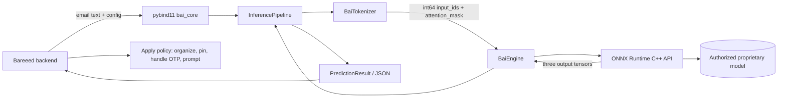

# Khwarazma BAI Architecture

Khwarazma BAI (Bareeed Artificial Intelligence) is the compact inference engine intended to power the Bareeed email organizer. Its product role is privacy-preserving mail triage: classify messages, detect OTPs, support important-message pinning, and provide confidence information that the Bareeed backend can use to automate high-confidence actions or prompt the user when confidence is low.

This document describes the implementation in the repository. Bareeed persistence, authorization, user-interface prompts, expiration jobs, and mailbox mutations are application-layer responsibilities and are not performed by the native engine.

## System layers

```text
Training and data preparation
  training/generate_data.py
  training/validate_data.py
  training/model.py
  training/train.py
  training/export.py
          |
          v
ONNX model artifact + vocabulary
          |
          v
C++23 runtime
  BaiTokenizer -> BaiEngine -> ONNX Runtime -> postprocessing
          |
          v
pybind11 module (bai_core) or C API
          |
          v
Bareeed Python backend
```

The public engineering surface is the C++ core, ONNX Runtime bridge, C API, and Python bindings. Production model weights remain proprietary and closed under the repository's BUSL-1.1 policy.

## Native inference pipeline

`bai::InferencePipeline` in `core/include/inference_engine.hpp` is the text-facing façade. Its `initialize()` method initializes both the engine and tokenizer. `predict()` performs the runtime path:

1. Reject an uninitialized pipeline or empty input.
2. Call `BaiTokenizer::encode(text, 512)`.
3. Pass `input_ids` and `attention_mask` to `BaiEngine::infer()`.
4. Convert five category logits to probabilities with a numerically stable softmax.
5. Select the greatest category probability.
6. Convert the OTP logit with a sigmoid and classify OTP presence using `otp_logit > 0`.
7. Return `PredictionResult`, including category, category confidence, OTP fields, overall confidence, and measured execution time.

## `BaiMicroEncoder` model architecture

`training/model.py` defines the Python training-time model class `BaiMicroEncoder`. It is a multi-task encoder with:

- token embeddings and learned positional embeddings;
- a six-layer `nn.TransformerEncoder`;
- `d_model=256`, eight attention heads, and feed-forward width `d_ff=1024`;
- attention padding derived from `attention_mask`;
- length-aware masked mean pooling over non-padding positions;
- `category_head`, producing five category logits;
- `otp_head`, producing one OTP logit; and
- `confidence_head`, producing one sigmoid-bounded confidence value.

`training/train.py` owns optimization and combines category cross-entropy, OTP binary cross-entropy, and confidence mean-squared error. `training/export.py` exports the model to ONNX (opset 17), validates the three outputs, and applies ONNX Runtime INT8 quantization. Python performs training/export; the C++ runtime performs inference.

The model's default constructor parameters are `vocab_size=50257`, `d_model=256`, `num_heads=8`, `num_layers=6`, `d_ff=1024`, `max_seq_length=512`, `num_categories=5`, and `dropout=0.1`. `_init_weights()` applies Xavier-uniform initialization to linear layers, normal initialization to embeddings, and unit/zero initialization to layer normalization. During `forward()`, positional indices are created for the active sequence length; padding positions are masked for the transformer and excluded from the masked mean pool. The pool is passed independently to the category, OTP, and confidence heads.

`BaiTokenizer` (`core/src/tokenizer.cpp`) loads the vocabulary from JSON, lowercases ASCII alphanumeric characters, preserves selected punctuation, collapses whitespace, adds `[CLS]` and `[SEP]`, and pads to the requested maximum length. Unknown pieces use `[UNK]`. Its word-piece matching is longest-prefix based and is independent of the Python training tokenizer; parity between these implementations is therefore a deployment concern.

## ONNX Runtime session management

`BaiEngine` (`core/src/engine.cpp`) owns `Ort::Env`, `Ort::Session`, and `Ort::MemoryInfo` through `std::unique_ptr`. Initialization:

- creates an ONNX Runtime environment;
- sets intra-op thread count from `EngineConfig::num_threads`;
- applies the configured graph optimization level;
- appends the CPU provider by default;
- conditionally appends CUDA when compiled with `ENABLE_CUDA` and `use_gpu=true`;
- opens the model path with `Ort::Session`;
- allocates fixed-size input buffers for `max_seq_length`;
- caches the input names `input_ids` and `attention_mask`;
- caches the output names `logits_category`, `logits_otp`, and `confidence`.

Each inference validates non-empty, equal-length inputs and the configured maximum sequence length, clears and fills the preallocated buffers, creates ONNX tensors, calls `session_->Run()`, and copies the three outputs into `InferenceResult`. The implementation reduces recurring buffer allocation but still creates temporary vectors/ONNX values and performs copies; “zero allocation” is a design intent, not a proven literal property.

The engine uses `std::expected` for native error results. ONNX Runtime and standard exceptions are translated into error strings. The pybind11 layer converts failed expected values to Python `RuntimeError`.

## Python and C interfaces

`core/bindings/bai_pybind.cpp` defines `PYBIND11_MODULE(bai_core, m)` and exposes:

- `EngineConfig`
- `InferenceResult`
- `PredictionResult`
- `BaiEngine`
- `InferencePipeline`
- `get_version()`

The binding uses `pybind11/stl.h` for `std::array`, `std::vector`, and string conversions. `EngineConfig` fields are writable from Python, including model path, thread count, device ID, GPU/FP16 flags, maximum sequence length, and graph optimization level. Methods returning `std::expected` are wrapped in lambdas that raise `RuntimeError` on failure.

`core/include/bai/c_api.h` provides an opaque handle API for non-Python callers: `bai_engine_create`, `bai_engine_infer`, `bai_engine_destroy`, status codes, and fixed-layout input/output structs. The C API owns the native engine after creation; callers must destroy the handle. The implementation stores detailed errors in thread-local storage, while `bai_get_error_message()` returns generic status text.

The mutable preallocated buffers in one `BaiEngine` instance are not protected by an explicit mutex. Concurrent inference calls sharing one instance are not established as safe by this repository and should be serialized or separately instantiated by the host.

## Bareeed backend data flow



The engine does not load `config/rules.json` or apply its thresholds itself. It returns model signals; Bareeed decides whether to automate, retain, purge, or request confirmation.

## Training-to-runtime contract

`training/model.py` defines `BaiMicroEncoder`: token and positional embeddings, six transformer encoder layers, length-aware masked mean pooling, and three heads. `training/export.py` exports the same three-output contract consumed by the C++ engine. The model is trained in Python and executed in production through ONNX Runtime; no PyTorch inference dependency is required by the C++ path.

## Known boundaries

The repository does not implement the memory-mapped model loader or atomic model-pointer hot swap described by earlier documentation. It opens the model path through ONNX Runtime during initialization. It also does not expose dialect predictions: dialect coverage is represented in data generation and validation rather than a dialect-aware branch in the runtime.
