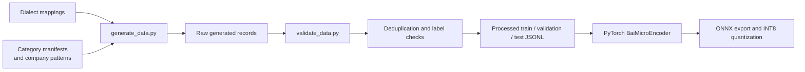

# Khwarazma BAI Datasets and Dialects

## Purpose and privacy boundary

The training pipeline is designed around generated data rather than private Bareeed production mail. `training/generate_data.py` is the principal synthetic-data producer. It combines dialect mappings, category manifests, company-pattern data, and generation templates to produce JSONL records. `training/validate_data.py` validates required fields and labels, deduplicates records by hash, and creates processed train/validation/test splits. `training/deep_audit_and_balance.py` audits text quality, duplicates, and pool/class distribution.

`generate_data.py` discovers dialects from `data/dialects_mapping/ar_dialects.json` and `en_dialects.json`, categories from `generation_manifest.json`, and company/scenario inputs from the manifests. It can call a local Ollama endpoint (`/api/generate`) with retries, temperature `0.8`, and top-p `0.9`; when unavailable or unusable it falls back to deterministic templates for Arabic and English. It writes per-dialect JSONL files under `data/raw/ar` or `data/raw/en`, mirrored category files under `data/raw/global`, and maintains progress plus a SQLite hash registry under `data/checkpoint`. Generation tasks run through a `ThreadPoolExecutor`.

The repository's product policy is that private user mail, production logs, credentials, and proprietary Bareeed data must not be submitted as contributions or used for unauthorized training.

## Dataset record and labels

Generated records contain text and model-ready fields including `input_ids`, `attention_mask`, `category_label`, and `otp_label`, together with language/dialect metadata used by the data pipeline. The training model consumes integer category labels 0 through 4:

```text
0 -> INBOX_PINNED
1 -> INBOX
2 -> BAIT
3 -> BAIS
4 -> BAIADS
```

Symbolic category names in manifests/configuration are uppercase, while native JSON output uses lowercase names. This cross-layer naming difference should be normalized by future data-contract work.

## Verified dialect inventory

The configuration and mapping files represent 29 dialect entries across two language families:

### Arabic: 19 entries

`ar-SA`, `ar-AE`, `ar-KW`, `ar-QA`, `ar-OM`, `ar-BH`, `ar-YE`, `ar-EG`, `ar-LEV-SY`, `ar-LEV-LB`, `ar-LEV-JO`, `ar-LEV-PS`, `ar-SD`, `ar-IQ`, `ar-LY`, `ar-TN`, `ar-DZ`, `ar-MA`, and `ar-MSA`.

### English: 10 entries

`en-US`, `en-GB`, `en-CA`, `en-AU`, `en-IN`, `en-ZA`, `en-NZ`, `en-IE`, `en-SG`, and `en-INT`.

`config/languages.json` declares 19 Arabic and 10 English dialects, and the corresponding mapping files and raw-data layout align with those counts. The processed training data was also observed to contain 29 dialect IDs.

## Coverage boundary

The 29-dialect claim describes data/configuration coverage, not a dialect classification output. The current model has category, OTP, and confidence heads only. `BaiTokenizer` performs generic normalization and word-piece tokenization; it does not branch on dialect, load dialect-specific keyword weights, or emit a detected dialect. `tests/test_dialects.py` exercises six hand-written samples (`ar-EG`, `ar-SA`, `ar-LEV`, `ar-MA`, `en-US`, and `en-GB`) and checks schema-valid predictions, not dialect-specific accuracy.

Therefore:

- **Verified:** 29 dialect entries are declared and represented in the data-generation/configuration layer.
- **Verified:** six representative Arabic/English strings pass the available runtime schema tests.
- **Not verified:** classification accuracy for each dialect, dialect detection, balanced performance across dialects, or runtime use of dialect metadata.

The v3/v4 roadmap calls for a future multi-dialect conversational engine. That capability is strategic direction and is not implemented in this v1 runtime.

## Generation flow



The Python-side data/tokenization path used by `generate_data.py` and the C++ tokenizer are separate implementations. A production-quality dataset release should include parity tests that feed the same text and compare token IDs, masks, special-token handling, truncation, and unknown-token behavior.

`validate_data.py` requires `text`, `category_label`, `otp_label`, `language`, and `dialect`. It accepts only `INBOX_PINNED`, `INBOX`, `BAIT`, `BAIS`, and `BAIADS`; restricts language to `ar` or `en`; normalizes Unicode with NFKC and collapsed whitespace; and requires BAIT records to have `otp_label == 1.0` and `confidence_multiplier == 1.5`. It writes `dataset_stats.json` and uses a seeded (`42`) category-stratified 80/10/10 split.

`deep_audit_and_balance.py` performs an independent raw JSONL audit: malformed JSON, missing fields, text shorter than 15 characters, low-quality text, and normalized duplicate text are counted. Valid records are pooled by `(dialect, category)`, shuffled with seed `42`, and split 80/10/10. It is an audit/export utility, not part of the native inference path.

## Normalization and OTP signals

The C++ tokenizer currently:

- lowercases characters accepted by the C locale's `isalnum`;
- preserves hyphen, underscore, and period;
- collapses whitespace;
- adds special tokens and padding;
- performs longest-prefix word-piece matching;
- preserves numeric characters as ordinary token content.

The source does not implement the richer Arabic normalization and explicit OTP-window extraction described in older documentation. OTP classification is performed by the model's `logits_otp` output and sigmoid postprocessing, not by a dialect-specific rules engine.

## Data quality and validation gaps

Available validation covers structure, required fields, deduplication, and a small runtime sample. It does not establish per-dialect accuracy, calibration error, OTP precision/recall, robustness to code switching, or distribution-shift behavior. `data/processed/dataset_stats.json` is stale relative to the observed processed JSONL contents and should not be treated as authoritative without regeneration.
